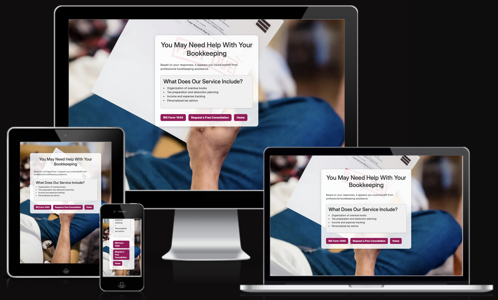
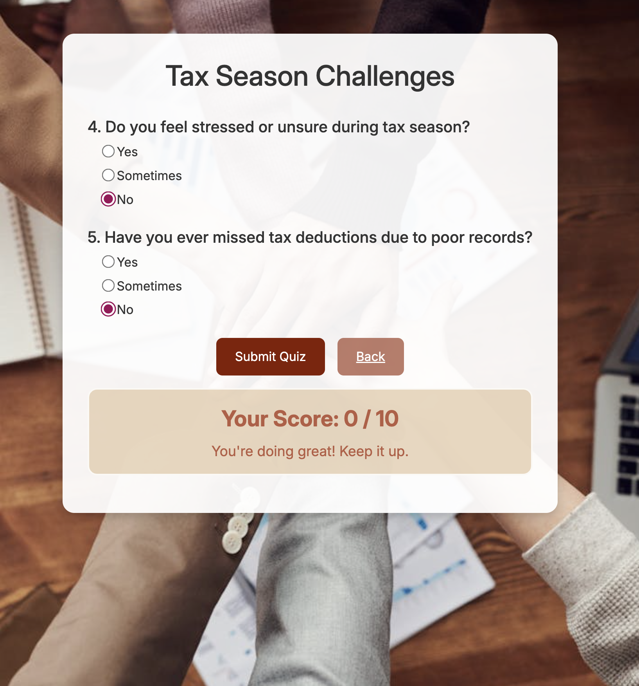
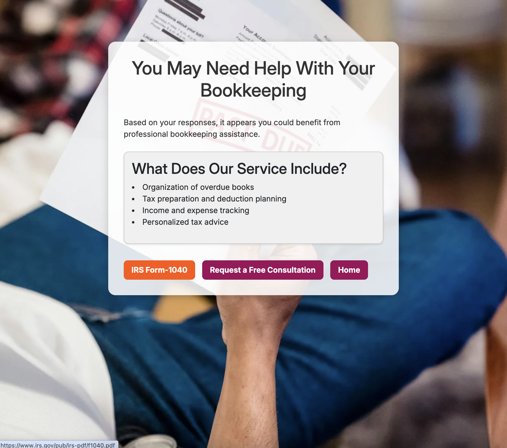
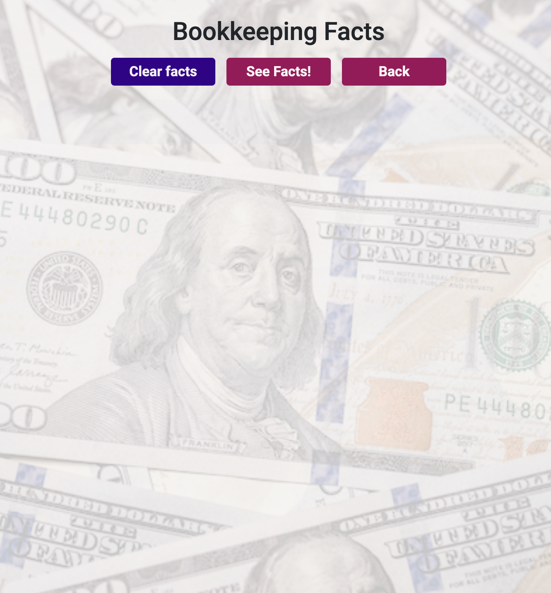
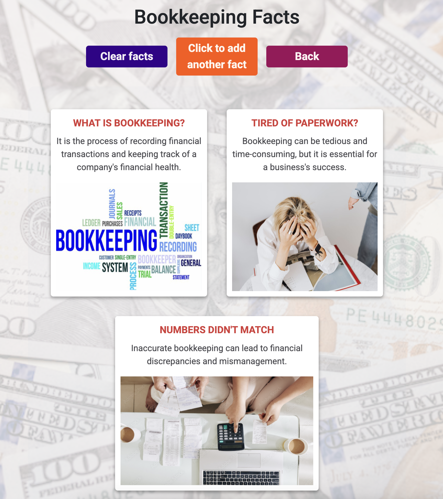
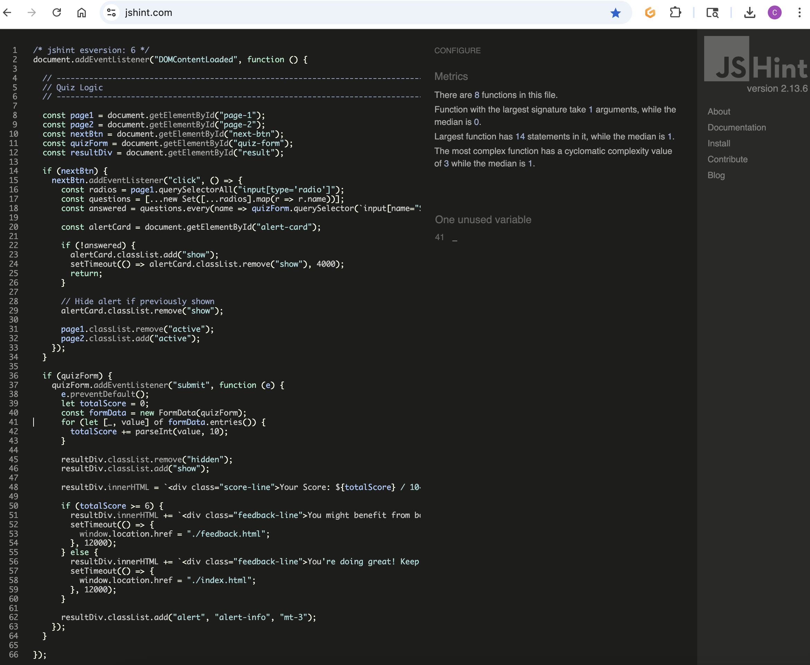
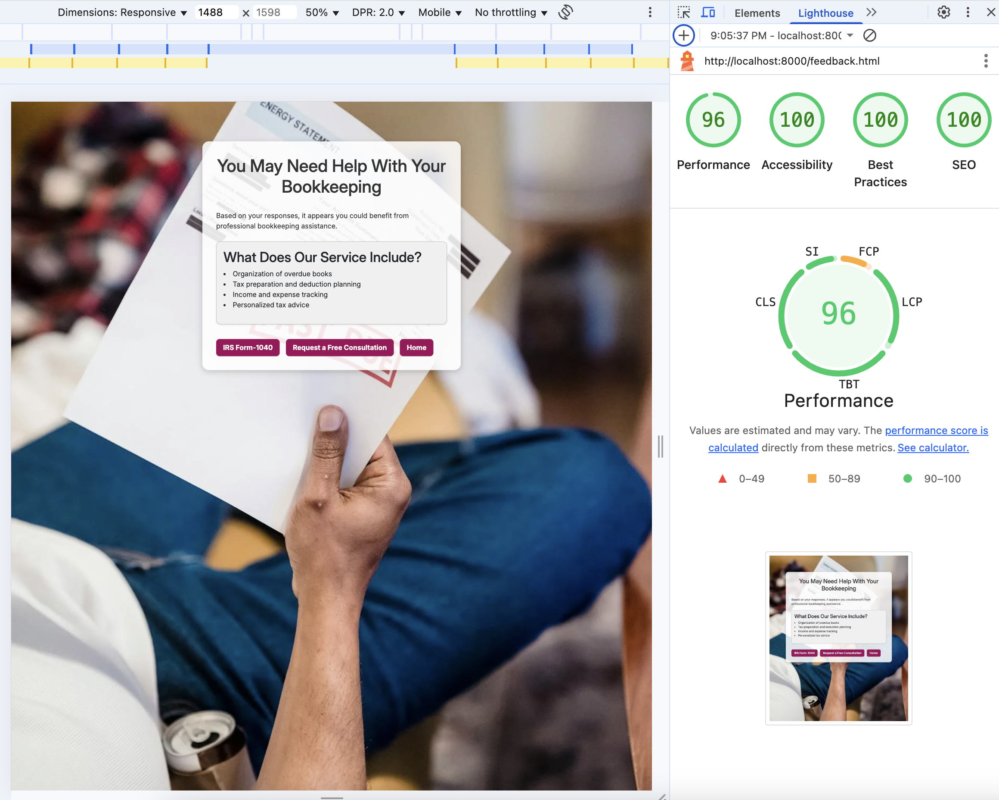
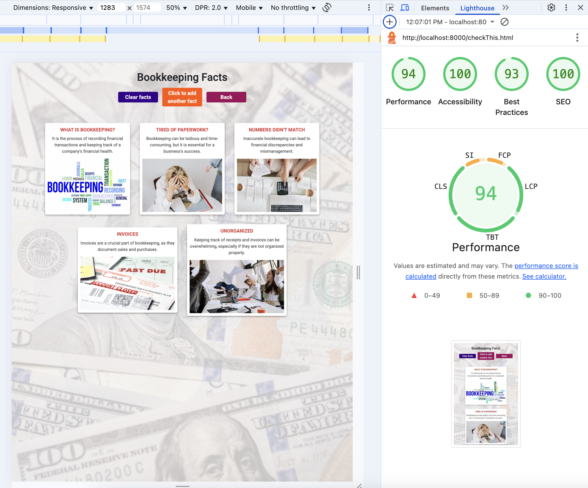
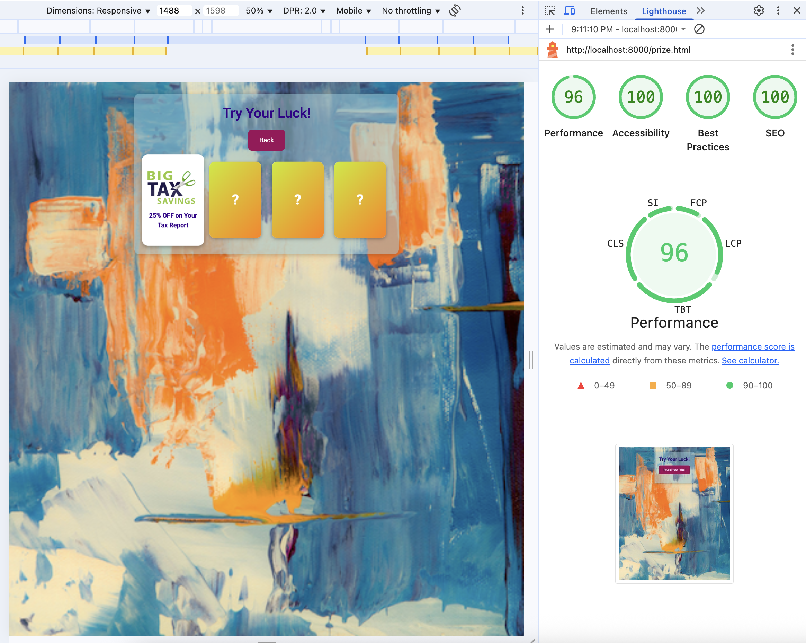

# 📊 Project2js – Bookkeeping Interactive Web App

## Code Institute - Second Milestone Project: User-Centric Frontend Development

## 🔗 Live Demo  
[👉 Try the live website](https://cynthiapinedoh79.github.io/Project2js/)  

---

“Project2js is a multi-page web app offering interactive tools for assessing bookkeeping needs. It features a quiz, educational facts, PDF access, and a gamified reward system.”

# 📋 Table of Contents
- [🧾 Project Overview](#🧾-project-overview)
- [📱 Am I Responsive? - Demo](#📱-am-i-responsive---demo)
- [🎯 UX](#🎯-ux)
- [🧑‍💼 User Stories](#🧑‍💼-user-stories)
- [🎨 Design Choices](#🎨-design-choices)
- [📐 Five Planes UXD](#📐-five-planes-uxd)
  - [📌 Strategy](#📌-strategy)
  - [📐 Scope](#📐-scope)
  - [🏗️ Structure](#🏗️-structure)
  - [🦴 Skeleton](#🦴-skeleton)
  - [🎨 Surface](#🎨-surface)
- [🛠️ Technologies & Design Choices](#🛠️-technologies--design-choices)
- [✨ Features](#✨-features)
  - [🚀 Existing Features](#🚀-existing-features)
  - [🔮 Features Left to Implement](#🔮-features-left-to-implement)
  - [🧑‍💻 Languages Used](#🧑‍💻-languages-used)
  - [🧰 Frameworks, Libraries & Programs Used](#🧰-frameworks-libraries--programs-used)
- [🧪 Testing & Validation](#🧪-testing--validation)
  - [✅ Browser & Device Testing](#✅-browser--device-testing)
  - [✅ Validator Testing](#✅-validator-testing)
  - [✅ Accessibility Testing](#✅-accessibility-testing)
  - [✅ Console in Google Chrome DevTools-"Inspect" Testing](#✅-console-in-google-chrome-devtools-inspect-testing)
  - [🧑‍💻 Testing User Stories – User Experience (UX) Evaluation](#🧑‍💻-testing-user-stories--user-experience-ux-evaluation)

  - [🐞 Bugs](#🐞-bugs)
  - [📥 Deployment](#📥-deployment)
  - [🌐 GitHub Pages Deployment](#🌐-github-pages-deployment)
  - [🍴 Forking the GitHub Repository](#🍴-forking-the-github-repository)
  - [📂 Making a Local Clone](#📂-making-a-local-clone)
- [🙏 Credits & Acknowledgements](#🙏-credits--acknowledgements)

---

## 🧾 Project Overview
Project2js is an interactive, feature-rich web application that introduces users to the world of professional bookkeeping. Designed for individuals and small businesses, it combines utility, engagement, and learning in one experience.
Key Features:

🧠 Personalized Quiz – Evaluate your bookkeeping needs in minutes

📄 Form 1040 PDF Access – Link to the official IRS form

📚 CheckThis!: Bookkeeping Fact Cards – Fast, educational insights

🎲 Play & Save!: “Try Your Luck” Mini-Game – Win a bonus or discount

This app aims to inform, engage, and guide users toward better financial organization.

---

## 📱 Am I Responsive? - Demo
All pages were designed with **Responsive Design** to provide a consistent experience across various screen sizes and devices.

### A live demo to the website 
[👉 Try the live website](https://cynthiapinedoh79.github.io/Project2js/) 

---

## 🎯 UX
### Target Audience:
Individuals and businesses seeking clarity, tools, and support in managing their finances.

### Core UX Goals:

1. Build trust and credibility through clean design and intuitive structure
2. Offer quick, interactive content that’s informative yet fun
3. Provide actionable takeaways (e.g., IRS form, consultation link)
4. Ensure accessibility and responsive design for all devices
5. Create opportunities for return visits and deeper engagement

### Main Site Goals:

- Promote core services through engaging features
- Attract potential clients through playful, educational content
- Help users assess their bookkeeping needs via a quick quiz
- Provide added value—discounts, tools, and practical insights—even for casual visitors
- Offer a ready-to-fill IRS Form 1040 PDF as part of the service suite
- (Coming Soon) Introduce a Tax Comparison Tool to highlight potential savings between LLC and S-Corp business structures
- (Coming Soon) Launch a Match Game that delivers quick, actionable tips for smarter financial decisions—covering bookkeeping, taxes, and business planning in a fun, easy-to-understand format

---

## 🧑‍💼 User Stories
- My Goal as Developer:
As the sole developer of this website, my mission is to provide you with an enjoyable and user-friendly experience while delivering clear, concise, and accurate information about our services — sparking your interest in what we offer.

- User Experience Objectives:
From the user’s perspective, I’ve built this site with the following priorities in mind:

  - I want to navigate this website quickly and easily.
  - I should be able to use a mouse, keyboard, or touchscreen effortlessly.
  - I value high-quality, well-organized information that I can consume in just a few minutes.
  - As a user, I need a simple and clear way to get in touch with you.

  ### First-Time Visitor Goals

  - As a First Visitor Goals:
      1. To quickly understand the main purpose of the site and discover what your company offers.
      2. To navigate the site effortlessly and find content that captures my interest.
      3. To be visually engaged by an attractive and inviting website that encourages me to explore further.
      4. To easily locate your contact information — ideally supported by testimonials or customer reviews to build trust.

  ### Returning Visitor Goals

  - As a Returning Visitor, 
       1. To find more detailed information about the services provided, including working hours.
       2. To easily discover the best way to contact the organization for any questions or support.
       3. To understand the available methods of communication — whether through Zoom, Skype, phone, or in-person meetings.

  ### Frequent User Goals
  - As a Frequent User,
       1. To conveniently access and fill out IRS Form 1040 directly through the site.
       2. To view brief and clear comparisons — such as LLC vs. S-Corp — to help make informed decisions.

---

## 🎨 Design Choices
  ### Description        
  This website is designed for visitors and new customers to explore, learn, win rewards, and enjoy an engaging experience while navigating through different pages.

  ### Typography
  Inter, Roboto family font is the main font used throughout the whole website with Sans Serif as the fallback font in case for any reason the font isn't being imported into the site correctly. Roboto is a clean font used frequently in programming, so it is both attractive and appropriate.

### Color Palette 
  - **Fonts:** Roboto, Inter – clean and modern  
  - **Colors:**  
    - Purple: trust and creativity  
    - Red/Orange: urgency and emphasis  
    - Muted tones: professionalism  
  - [Contrast checked with WebAIM](https://webaim.org/resources/contrastchecker/)

  ### Colour Psychology
  
  

  ### Imagery  
  Clear and attractive images support the theme and maintain strong contrast with text for optimal readability.
- Financial and office-themed backgrounds  
- High contrast text overlays for readability  

---

  ### 1. Home: index.html
        
  - Background: 
  A blurred photo of financial charts and a blue pen (soft blue, red, beige tones)

  - Text: Dark purple for "Needs Bookkeeping?"
  - Buttons: Quick Quiz, Check this! and Play & Save!
    - Background Color: Purple.
    - Hover: Dark Red.
  - Color Mood: Professional, calm, and trustworthy (purple conveys reliability and creativity).

  ### 2. Quiz: quiz.html

  - Background: A soft focus image of hands joined in teamwork (brown, beige, and gray tones).

  - Card Background: Semi-transparent white.
  - Text: Black.
  - Buttons: Next, Submit Quiz and Back.
    - Background Color: Muted Brown.
    - Hover: Dark Brown.

  - Alert Score: 
    - Background: Light beige or cream color.
    - Font Color: Medium to dark brown/red.
    - Background Color: Muted Brown.
    - Hover: Dark Brown.

  - Color Mood:Professional, calm, and trustworthy (purple conveys reliability and creativity)

  ### 3. Results Page "You May Need Help With Your Bookkeeping": feedback.html
  - Background: A real-life business photo (blue jeans, papers) — neutral tones with blue and tan
  - Header: Dark gray/black
  - Card background: Soft white with subtle shadow
  - Call-to-action buttons: IRS Format-1040 pdf(IRS link), Consultation (link to website) and Home(Back to main page).
    - Background Color: Deep purple
    - Hover: Dark Red.

  - Overall Color Mood: Trustworthy and clean with modern neutrality, purple buttons continue your branding identity.

  ### 4. Bookkeeping Facts Page: checkThis.html
  - Background: Lightly visible money-themed image (dollar bills) as a faded background
  - Titles/Headers: Red shades (#C62828-like)
  - Text: Black
  - Call-to-action buttons: Clear Facts, See Facts!-Click to add another fact, and Back (to Home page).
    - Clear Facts button:
      - Background Color: Deep purple
      - Hover: Green.
    -  buttons: Facts!-Click to add another fact, and Back
      - Background Color: Dark Red
      - Hover: Orange.
  - Card Borders and Text: Varying tones of red, black, gray
  - Color Mood: More attention-grabbing and informational (reds for urgency, purple for brand consistency)

  ### 5. Play & Save Page: prize.html
  - Background: Bright, abstract art (orange, blue, white swirls)
  - Title Text: Purple
  - Button: Bold magenta/dark pink
  - Color Mood: Energetic and playful — encourages participation and feels exciting

## 📐 Five planes UXD

### 📌 Strategy
Our objective is to create a website that is both professional and functional. Our focus is on design that is both intuitive and creative.

### 📐 Scope
The site is designed for two main user groups:
1.	Visitors, who can enjoy interactive games, helpful tips, new information, and practical advice.
2.	Potential new customers, who can explore special offers like a bookkeeping bonus award, contact us easily, or quickly access the Form 1040 submission link.

### 🏗️ Structure
The website is designed with HTML5, CSS3 and JS.

**Website Pages:**
1. **_Needs Bookkepping?:_** Main page with three buttons (Quiz, Check This! and Play & Save!)
2. **_Quiz:_** A brief quiz with a few questions that are scored to assess user needs.
3. **_Feedback:_** A feedback message is shown if your answers indicate that you may need our help or services. It includes a link to fill out Form 1040 and a direct link to contact us through our website.
4. **_CheckThis:_** Displays Bookkeeping Fact Cards with useful information.
6. **_Prize:_** Try Your Luck! Win a special prize or bookkeeping bonus—just reach out to claim your reward!

### 🦴 Skeleton
The website is designed to be clear and simple. And the site has a simple tree structure with hierarchical flows from top to bottom.

**Wireframe**
The wireframe is designed using Balsamiq software 
[Balsamic](https://balsamiq.cloud/ss26tqg/p4441iq/rD01A)

#### Home

#### Quiz

#### Check This!

#### Play & Save!

### 🎨 Surface
To create a pleasing and understandable view, I opt for natural colors such as earth, green, and a range of tones that complement and contrast each other.

---

## 🛠️ Technologies & Design Choices
1. HTML - Used to build the basic structure of the website.
2. CSS - Styles the front-end to create a visually appealing design and enhance user experience.
3. Balsamiq - Used to design wireframes and plan the layout of the site before development.
4. JS -  Adds interactivity to the website, making the experience more dynamic and engaging for users.

*Webaim
[Tested contrast](https://webaim.org/resources/contrastchecker/)
*Coolors
[Tested color](https://coolors.co/contrast-checker/33008a-f8f8ff)

_Main color palette_

---

## ✨ Features

### 🚀 Existing Features
### HTML Files
  ### 1. Home Page: index.html

  Headline Prompt:

  - HOME: "Needs Bookkeeping?" – A clear, central question targeting the user’s intent.

  - Background Image: A professional, finance-related image (charts and a hand with a pen) that supports the bookkeeping theme.

  - Call-to-Action (CTA) Buttons:

    - Quick Quiz – Likely leads to an interactive assessment to evaluate bookkeeping needs.

    - Check This! – Possibly redirects to a page with useful bookkeeping facts or tips.

    - Play & Save! – An engaging gamified option to win discounts or special offers.

  - Visual Styling: High contrast between button text (white) and button background (dark purple).

  - Very dark green header text helps capture attention.

  - Central alignment of all content for focus and simplicity.

  - Transparent background or slight blur behind text for better readability on the image.
    
  

  ### 2. Quiz: quiz.html
  This interactive quiz helps users determine whether they may need taxes, finances, or bookkeeping support. It consists of two short sections:

  1. Bookkeeping Habits – Questions focused on time spent, disorganization, and tracking issues.

  2. Tax Season Challenges – Questions related to stress during tax season and recordkeeping for deductions.

  Each question offers Yes / Sometimes / No options. Based on the user’s responses:

  - A score out of 10 is calculated.
  - A personalized feedback message is shown.

  If the score suggests the user might not need help (0-5 pts), they are redirected to Home.

  If the score suggests the user might need help (> 6 pts), they are redirected to relevant services like Form 1040 submission or contact options.

  The clean UI, transparent card background, and motivating CTA buttons make the experience smooth and user-friendly.

  
  

  #### Users who score less than 6 on the quiz can navigate back to the Home Page using the Back button.
  
  #### If the quiz score is 6 or higher, the user is redirected to the Bookkeeping Feedback Page
  

  ### 3. Feedback: feedback.html
  Displays feedback based on quiz results. High scores lead to a message with three action buttons:
    - Fill Form 1040 pdf
    -	Contact Us via Website
    - Home (this button allows users to return to the main site.)

  Bookkeeping Assessment Result: After completing the quiz, users who score within a certain range are shown a feedback message:

  Headline: You May Need Help With Your Bookkeeping.

  Message: 
  A supportive summary that explains the result:  
  - "Based on your responses, it appears you could benefit from professional bookkeeping assistance."

  - What the Service Includes:
    - A bullet-point list highlights the key benefits:
    - Organization of overdue books
    - Tax preparation and deduction planning
    - Income and expense tracking
    - Personalized tax advice

  - Call-to-Action Buttons:
    - IRS Format-1040 pdf – Directs the user to begin completing the official tax form with IRS.
    - Request a Free Consultation offering an easy way to reach out and get help.
    - Redirecting to Home.

  - Design Notes:
    - Clean, transparent card UI over a background image related to finance/taxes.
    - Clear visual hierarchy with bold headlines, informative content, and strong CTAs.
    - Colorful, accessible buttons for quick action.

  #### IRS Form 1040 pdf
  
  
  
  

  #### Request a Free Consultation (Website link)
  
  

  #### Home- Navigates the user back to the main landing page of the application.
  

--- 

  ### 4. Bookkeeping Fact Cards (Check This!): checkThis.html
  Linked from the main page; presents interesting Bookkeeping Facts.

  This interactive panel provides users with quick, digestible insights into bookkeeping essentials. Each fact is visually supported with a relevant image and a concise explanation.
  - Illustrated cards with bite-sized facts  
  - Reset functionality
  - A “Back” button allows users to return to the main site.

  *Card Topics:*
  - What is Bookkeeping? 
  Explains the core definition and purpose of recording financial transactions.

  - Tired of Paperwork?
  Acknowledges the burden of bookkeeping while reinforcing its importance for business success.

  - Numbers Didn't Match
  Highlights the consequences of inaccurate bookkeeping such as discrepancies and poor financial management.

  - Invoices
  Emphasizes the importance of invoices in tracking sales and purchases.

  - Unorganized
  Stresses how disorganized records can become overwhelming and lead to errors.

  - Gross, Net, and Taxable Income
  Educates users on key income terms:

    - Gross Income = total revenue before expenses

    - Net Income = profit after expenses

    - Taxable Income = income subject to tax

  - Design Highlights:
  Consistent card layout with bold titles and brief content.

  - Visually engaging with contextual images to aid understanding.

  - A "Clear facts" button for interactivity (possibly resets or filters facts).

  - Background includes a money-themed image for subtle visual relevance.

  #### Users can navigate back to the Home Page using the Back button.
  
  
  #### After the first click, the "See Facts!" button updates to "Click to add another fact" and remains available until six fact cards are shown.
  

  #### "Click to add Another Fact"-button is hidden once six fact cards have been displayed.
  

---

  ### 5. Prize Page (Play & Save!): prize.html
  A fun interactive page where users can win a discount or special offer.

  Try Your Luck! – Interactive Prize Game
  An engaging and gamified feature that rewards users for exploring your services.
  - Flip-one-card game  
  - Reveal a surprise reward  
  - High visual contrast and animation effects  

  How It Works:
  Users are presented with four mystery cards.

  Each card is styled with a golden gradient and a ? mark to indicate a hidden offer.

  Upon clicking one card, it flips over to reveal a special reward (e.g., “50% OFF on Your First Consultation”).

  A “Back” button allows users to return to the main site.

  Design Highlights:
  - Modern, colorful background with abstract art for visual impact.

  - Hover and flip effects make the interaction feel dynamic and responsive.

  - Centered card layout keeps the user’s focus on the reward selection.

  Purpose:
  - Boosts user engagement.

  - Provides an incentive to try services.

  - Encourages users to contact you or schedule a consultation.

  
  

---

### CCS Files
Currently, all styles are consolidated in a single CSS file (quiz.css) for simplicity.
1. quiz.css – Contains all custom styling for the website, including layout, typography, color schemes, button designs, responsive behavior, and section-specific formatting across all pages.

---

### JS Files.
1. index.js – Manages all logic related to the homepage, including navigation and event handling for the three main buttons: Quiz, Check This!, and Play & Save!.
2. quiz.js – – Handles all logic related to the quiz feature, including navigation, score calculation, and conditional redirects based on user answers.
3. facts.js – Controls the behavior of the fact card section, such as generating, cycling through, and resetting educational bookkeeping facts.
4. prize.js – Manages the “Play & Save!” mini-game logic, including card reveal animation, prize display, and back navigation.

---

### 🔮 Features Left to Implement

1. **Performance Optimization**  
   Further streamline scripts and assets to improve load times and Lighthouse scores.

2. **Tax Structure Comparison Tool**  
   An interactive calculator to compare LLC vs. S-Corp options, showing:
   - Estimated tax savings
   - Liability protection
   - Legal requirements
   - Suitability based on business type or income level
   - Best-use scenarios

    This tool will assist small business owners in choosing the right entity type to maximize financial efficiency and minimize tax burden.

3. **Financial Match Game (Memory Style)**  
   A gamified learning tool to reinforce:
   - Bookkeeping best practices
   - Smart tax strategies

Business structure insights (LLC, S-Corp, Sole Prop, etc.)
The game will deliver practical, easy-to-understand content that helps users make smarter business and tax decisions, all while keeping the learning experience enjoyable.

---

## 🧑‍💻 Languages Used

-   [HTML5](https://en.wikipedia.org/wiki/HTML5) Hypertext Markup Language.
-   [CSS3](https://en.wikipedia.org/wiki/Cascading_Style_Sheets) Cascading Style Sheets.
-   [JS](https://en.wikipedia.org/wiki/JavaScript) JavaScript.

---

## 🧰 Frameworks, Libraries & Programs Used

1. [Bootstrap 5.3.3:](https://getbootstrap.com/docs/5.3/getting-started/introduction/)
    - Bootstrap was used to assist with the responsiveness and styling of the website. This framework helps designing websites. It includes HTML and CSS based design templates for typography, forms, buttons, tables, navigation, modals, image carousels, etc. It also gives you support for JavaScript plugins. 
2. [Hover.css:](https://ianlunn.github.io/Hover/)
    - Hover.css was used on the Social Media icons in the footer to add the float transition while being hovered over.
3. [Google Fonts:](https://fonts.google.com/)
    - Google fonts were used to import the 'Titillium Web' font into the style.css file which is used on all pages throughout the project.
4. [Font Awesome:](https://fontawesome.com/)
    - Font Awesome was used on all pages throughout the website to add icons for aesthetic and UX purposes. Designers love the use of icons as fonts because of the flexibility of styling available with high-quality iconography on every device.
5. [jQuery:](https://jquery.com/)
    - jQuery came with Bootstrap to make the navbar responsive but was also used for the smooth scroll function in JavaScript. JQuery for DOM manipulation.
6. [Git](https://git-scm.com/)
    - Git was used for version control by utilizing the Gitpod terminal to commit to Git and Push to GitHub.
7. [GitHub:](https://github.com/)
    - GitHub is used to store the projects code after being pushed from Git.
8. [Visual Studio Code:](https://code.visualstudio.com/)
    - Visual Studio Code for code editor with AI.
9. [Photoshop:](https://www.adobe.com/ie/products/photoshop.html)
    - Photoshop was used for editing photos for the website.
10. [Squoosh:]( https://squoosh.app/)
    - Sqoosh App to resize or compress image files, and change file extension for the website.
11. [Balsamiq:](https://balsamiq.com/)
    - Balsamiq was used to create the [wireframes](https://balsamiq.cloud/s45whoh/p56wz1i/r2278) during the design process.
12. [Responsive Screenshots](https://ui.dev/amiresponsive)
    - To capture responsive screenshots across devices.
13. [Contrast Checker](https://webaim.org/resources/linkcontrastchecker/?fcolor=CDA37C&bcolor=FFFF00)
    - Webaim Contrast Checker.
14. [Coolors](Coolorshttps://coolors.co/)
    - Coolors App is a pallet generator & pallet visualizer.
15. Lighthouse by Google-Inspect
    - Generate a Lighthouse report by Google: Performance, Accesibility, Best Practices, and SEO.
16. [W3C Markup Validator](https://jigsaw.w3.org/css-validator/#validate_by_input)
    - W3C Markup Validator
17. [W3C CSS Validator](https://jigsaw.w3.org/css-validator/#validate_by_input)
    - W3C CSS Validator
18. [Youtube](https://www.youtube.com/)
    - YouTube
19. [Pexels]( https://www.pexels.com/)
    - Pexels
20. [W3 Schools]( https://www.w3schools.com/)
    - W3 Schools

---

## 🧪 Testing & Validation
### ✅ Browser & Device Testing  
- Web browsers: Chrome, Firefox, Safari, and Microsoft Edge.
-  On mobile devices: iPhone 13 Mini, Pixel 7 Pro.
-  On laptops: MacBook Pro 14”, MacBook Pro 16”.
- DevTools used for responsive checks 
-  The navigation, pages, and content sections are clear, readable, and easy to navigate.
- The form validation works correctly: required fields enforce input, email fields only accept valid formats, and the submit buttons function as expected.

---

### ✅ Validator Testing
- HTML: W3C Markup Validator  
- CSS: W3C CSS Validator  
- JavaScript: JSHint – no errors  

These tools ensured that all pages were free of syntax errors and followed best coding practices.

---

## HTML
  All pages have passed the official W3C Markup Validator with no errors.

### Home Page and Quiz Flow

  #### Home Page: [`index.html`](index.html)
  This is the landing page titled **"Needs Bookkeeping?"** where users begin their experience.
  .png)

---

  #### Quiz Pages: [`quiz.html`](quiz.html)
  After clicking the **"Quiz"** button, users are guided through interactive questions to assess their bookkeeping needs.
  

---

  #### Feedback Page: [`feedback.html`](feedback.html)
  Based on the quiz answers, users receive tailored feedback and helpful suggestions.
  

---

  ### Page After Clicking "Check This!"

  #### Informational Page: [`checkThis.html`](checkThis.html)
  This page appears after clicking the **"Check This!"** button. It presents engaging facts or financial tips in a visually dynamic layout.
  

---

  ### Page After Clicking "Play & Save!"

  #### Prize Game Page: [`prize.html`](prize.html)
  This interactive page is loaded after users click the **"Play & Save!"** button. It reveals a fun and engaging prize game that may offer discounts or perks.
  

---

## CSS
All pages have passed the official W3C CSS Validator with no errors.

  #### Quiz
  #### Informational Page: [`quiz.css`](quiz.css)
  

---

## JS
All pages have passed the official JSHint with no errors.

  #### Index
  #### Informational Page: [`index.js `](index.js)
  

---

  #### Quiz
  #### Informational Page: [`quiz.js `](quiz.js)
  

---

  #### CheckThis!
  #### Informational Page: [`checkThis.js `](checkThis.js)
  

---

  #### Prize
  #### Informational Page: [`prize.js `](prize.js)
  

---

### ✅ Accessibility Testing
- Lighthouse DevTools by Google
### Home Page and Quiz Flow
  #### Home Page: [`index.html`](index.html)
  

  ---

  #### Quiz Pages: [`quiz.html`](quiz.html)
  .png)
  .png)

  ---

  #### Feedback Page: [`feedback.html`](quiz.html)
  
   
  ---

  #### Check This! Page: [`checkThis!.html`]( checkThis.html)
  

  ---

  #### Save & Play! Page: [`prize.html`]( quiz.html)
  

---

### ✅ Console in Google Chrome DevTools-"Inspect" Testing
- Console Error Testing using Google Chrome DevTools

  Each page was tested via the Console tab in Chrome's Developer Tools to detect and resolve any JavaScript or resource-related issues. All known 404, syntax, or runtime errors were addressed, ensuring a clean console output across the site.

### Home Page and Quiz Flow
  #### Home Page: [`index.html`](index.html)
  /Console-index.png)

  ---

  #### Quiz Pages: [`quiz.html`](quiz.html)
  /Console-quizpg1.png)
  /Console-quizpg2.png)

  ---

  #### Feedback Page: [`feedback.html`](quiz.html)
  /Console-feedback.png)
   
  ---

  #### Check This! Page: [`checkThis!.html`]( checkThis.html)
  /Console-checkThis.png)

  ---

  #### Save & Play! Page: [`quiz.html`]( prize.html)
  /Console-prize.png)

---

### 🧑‍💻 Testing User Stories – User Experience (UX) Evaluation

#### First-Time Visitor Goals

1. **Understand the Site's Purpose and Offerings Quickly**
   - Upon arrival, users are greeted with a clean layout featuring clearly labeled buttons and intuitive navigation.
   - The site uses visually appealing background images, a vibrant color palette, and strong contrast for optimal readability.
   - Calls-to-action (CTAs) are prominently placed, encouraging users to begin exploring key services or features.

2. **Navigate Effortlessly and Discover Relevant Content**
   - The site structure is fluid and user-friendly, allowing seamless transitions between pages.
   - Each section is purpose-driven, with dynamic content that aligns with the user's needs or interests.

3. **Feel Visually Engaged and Motivated to Explore**
   - First-time users encounter a visually compelling design that captures attention and invites exploration.
   - Interactive elements and engaging content foster curiosity and encourage deeper engagement with the site.

4. **Easily Find Contact Information and Trust Signals**
   - Contact options are clearly presented and accessible across all pages.
   - Customer testimonials or reviews are integrated to build credibility and foster trust with new visitors.

#### Returning Visitor Goals

As a Returning Visitor, I want to:

1. **Access More Detailed Information About Services**
   - Gain deeper insights into the services offered, including descriptions, pricing, and available packages.
   - View updated details such as business hours, availability, and seasonal offerings.

2. **Quickly Find the Best Way to Get in Touch**
   - Locate contact methods without effort, whether it's through a dedicated contact page, live chat, or email.
   - Know who to reach out to for specific inquiries or support needs.

3. **Understand Available Communication Options**
   - Clearly see if meetings or consultations are offered via Zoom, Skype, phone calls, or in-person appointments.
   - Choose the most convenient method for follow-ups or service discussions.

---

#### Frequent User Goals

As a Frequent User, I want to:

1. **Easily Access and Submit IRS Form 1040**
   - Fill out and submit the IRS Form 1040 through a simple and secure on-site form.

2. **View Helpful Financial Comparisons for Smarter Decisions**
   - Quickly review side-by-side comparisons such as **LLC vs. S-Corp** structures with graphics.
   - Use this information to make informed decisions about taxes, bookkeeping needs, or business structure changes.

#### Further Testing

- The website was thoroughly tested across major web browsers, including **Google Chrome**, **Safari**, **Microsoft Edge**, and even **Internet Explorer** to ensure cross-browser compatibility.
- Device testing was conducted on a range of platforms, including **desktop and laptop computers**, as well as mobile devices such as **iPhone 7, iPhone 8, and iPhone X**.
- Comprehensive internal testing was performed to confirm that **all internal and external links functioned correctly**, and that navigation between pages was smooth and intuitive.
- Usability testing involved feedback from **friends and family members**, who were invited to explore the site and identify any bugs, broken functionality, or areas of improvement from a user experience (UX) perspective.

---

### 🐞 Bugs
### Solved Bugs

- Significant bugs were identified and resolved across all major development areas, including **HTML5**, **CSS3**, and **JavaScript**.
- Several spelling and grammar issues were corrected throughout the project to improve clarity and professionalism.
- Improved navigation by adding functional Back/Home buttons to return to the main page.
- Resolved JavaScript syntax errors to ensure cleaner and more maintainable code.
- Verified in Google Chrome Developer Tools that the console is free of errors after inspection for each page.

---
### Unsolved Bugs / Areas for Improvement

- **CSS cleanup**: Some unused or redundant CSS rules should be removed to reduce file size and improve maintainability.
- **Code optimization**: Grouping and organizing code by section or page can make it easier to deploy, reduce the likelihood of bugs, and improve performance.
- **Lighthouse Performance**: The site's performance metrics (as measured by Google's Lighthouse tool) can be improved by further optimizing code, assets, and loading behavior.

---

## 📥 Deployment
### 🌐 GitHub Pages Deployment

The project was successfully deployed to **GitHub Pages** using the steps below:

1. Log in to GitHub and open your project’s [repository](https://github.com/).
2. At the top of the repository (below the repo name, not the site header), click on the **"Settings"** tab.
   - Alternatively, view a GIF tutorial by clicking [Link to GitHub Docs](https://raw.githubusercontent.com/).
3. In the left-hand sidebar under **"Code and Automation"**, click on **"Pages"**.
4. On the GitHub Pages screen, scroll down to the **"Source"** section.
5. Click the dropdown that says **"None"** and select **"Master Branch"** (or **"main"**, if that's your default).
6. The page will refresh automatically and display the deployment status.
7. Scroll down again to find the live URL of your published site under the **"GitHub Pages"** section.
   - Example: [https://your-username.github.io/your-repo-name](https://github.com)

You can now access your project live on the web using the provided GitHub Pages URL.

### 🍴 Forking the GitHub Repository

  Forking a GitHub repository allows you to create a personal copy of the original project in your own GitHub account. This enables you to freely explore, modify, or contribute without affecting the original codebase. Follow these steps:

  1. Log in to GitHub and open the target [GitHub Repository](https://github.com/).
  2. At the top-right corner of the repository page (just above the "Settings" tab), click the **"Fork"** button.
  3. GitHub will create a copy of the repository under your own account.
  4. You can now freely edit, update, and experiment within your forked version without impacting the original repository.

### 📂 Making a Local Clone

  Follow these steps to create a local copy of the repository on your machine:
   
  1. Log in to GitHub and navigate to the target [GitHub Repository](https://github.com/).
  2. Below the repository name, click the **"Code"** button (formerly "Clone or download").
  3. Under **"Clone with HTTPS"**, copy the provided URL.
  4. Open **Git Bash** (or your terminal of choice).
  5. Change the current working directory to the location where you want the cloned project to reside.
  6. Type the following command and paste the URL you copied in Step 3:
  
    git clone https://github.com/YOUR-USERNAME/YOUR-REPOSITORY

  7. Press Enter. Git will create a full local clone of the repository:

    $ git clone https://github.com/YOUR-USERNAME/YOUR-REPOSITORY

  Cloning into 'project-folder'or `CI-Clone`...
  remote: Counting objects: 10, done.
  remote: Compressing objects: 100% (8/8), done.
  remote: Total 10 (delta 1), reused 10 (delta 1)
  Unpacking objects: 100% (10/10), done.
  

📎 For additional guidance and visual steps, visit GitHub’s official help guide:
Cloning a repository – GitHub Docs

---

## 🙏 Credits & Acknowledgements
* Code Institute
* Dette Bookkeeping: Website [Dette Bookkeeping & More, LLC]( https://dette-bookkeeping.com/)

### Code, Resources & References

- [Stack Overflow](https://stackoverflow.com)  
  Used for troubleshooting and researching common development issues during the project.
- [Bootstrap 5.3.3 Documentation](https://getbootstrap.com/docs/5.3/getting-started/introduction/)  
  Bootstrap library was used throughout the project to create a responsive layout using the Bootstrap Grid System.
- [Google](https://www.google.com)  
  Utilized for general development research, code examples, and technical clarification.

### Content
* I used as example from the Code Institute's [Fun Coding Facts]
* I used as example from the Code Institute's [Love Maths]( https://github.com/cynthiapinedoh79/Love-Maths) project.

-   Content was written by developer.

-   Free Color Psychology Resources
1.	Color Psychology
→ In-depth guide on how colors affect behavior, mood, and decision-making.
2.	Canva – Color Meanings
→ Visual and practical breakdown of color symbolism in design and branding.
3.	Color Matters
→ Educational resource on color symbolism, theory, and real-world impact.
4.	Psychological Properties of Colours – Academia.edu
→ A scholarly article on color psychology by Angela Wright.
5.	Verywell Mind – Color Psychology
→ Psychology-backed overview on how color influences emotions and perception.

### Media

- [freestocks](https://freestocks.org/)
- [pixabay](https://pixabay.com/)
- [unsplash](https://unsplash.com/)
- [pexels](https://pexels.com/)

### 🙏 Acknowledgements

- I would like to express my sincere gratitude to the **Code Institute support team** (mentor, tutor and Student Care) for their unwavering guidance and encouragement throughout the development of this project.
- A special thanks to my mentor, Medale Oluwafemi, whose insightful advice, constructive feedback, and continuous support were instrumental to my progress.
- Appreciation to the Code Institute Slack community for their valuable assistance and shared insights during moments of challenge.
- My heartfelt thanks go to **Code Institute** for offering an exceptional course that laid the foundation for this project and significantly advanced my learning journey.
- Finally, I was inspired by the diverse and creative example projects showcased by **Code Institute**, which helped shape and refine the vision for my own work.

---

